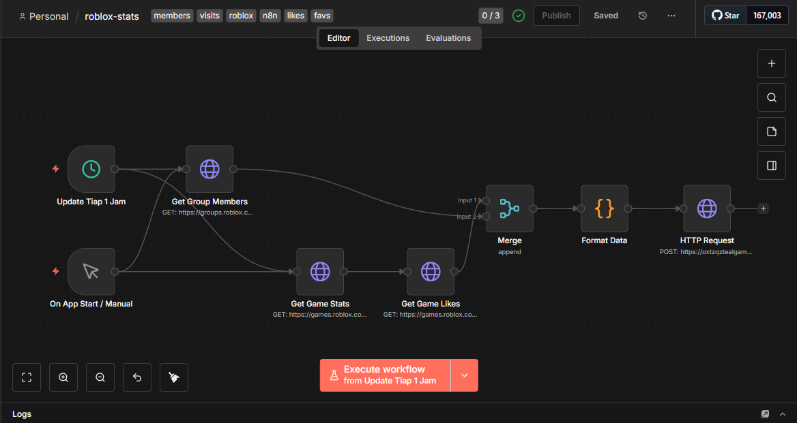

# 🤖 Roblox Stats Automation with n8n & Supabase


[](https://opensource.org/licenses/MIT)
[](https://fuenzerstudio.netlify.app)

**Automated changes to Roblox games data such as visits, likes, favorites, and members using n8n with data stored in Supabase.**

## 📖 Overview

This repository hosts an n8n workflow designed to track and archive the growth of Roblox games and groups. It runs on a schedule (every 1 hour) to fetch real-time data from the Roblox API and stores the historical data into a Supabase database for further analysis or visualization on a dashboard.

## 📸 Workflow Preview



## ✨ Features

* **Automated Scheduling:** Runs automatically every 1 hour or on app start.
* **Data Aggregation:** Fetches data from multiple endpoints simultaneously:
    * 👥 **Group Members:** Tracks total member count.
    * 🎮 **Game Visits:** Tracks total play sessions.
    * 👍 **Likes:** Tracks upvotes/likes on the game.
    * ⭐ **Favorites:** Tracks how many users favorited the game.
* **Data Storage:** Formats and pushes clean JSON data to **Supabase** via HTTP Request.

## 🛠️ Tech Stack

* **Automation:** [n8n](https://n8n.io/) (Self-hosted/Cloud)
* **Database:** [Supabase](https://supabase.com/) (PostgreSQL)
* **Source:** Roblox Web Web API (Games & Groups endpoints)

## 🚀 How to Use

1.  **Import Workflow:**
    * Download the `.json` file from this repository.
    * Open your n8n editor.
    * Click usually in the top right menu: `Import from File`.

2.  **Configure Nodes:**
    * **Get Group Members:** Update the `group_id` in the URL.
    * **Get Game Stats:** Update the `universe_id` in the URL.
    * **HTTP Request (Supabase):**
        * Set Method to `POST`.
        * Add your Supabase URL.
        * Add Headers: `apikey` and `Authorization` (Bearer token).

3.  **Activate:**
    * Toggle the workflow to **Active**.

## 📝 Data Structure

The workflow prepares a JSON object similar to this before sending to Supabase:

```json
{
  "timestamp": "2026-01-07T15:00:00.000Z",
  "group_members": 1500,
  "visits": 25000,
  "likes": 340,
  "favorites": 120
}
```
