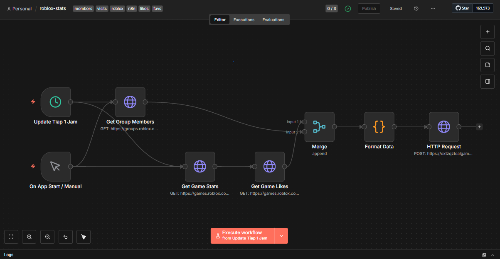

# 🤖 Roblox Stats Automation with n8n & Supabase


[](https://opensource.org/licenses/MIT)
[](https://fuenzerstudio.netlify.app)

**Automated changes to Roblox games data such as visits, likes, favorites, and members using n8n with data stored in Supabase.**

## 📖 Overview

This repository hosts an n8n workflow designed to track and archive the growth of Roblox games and groups. It runs on a schedule (every 1 hour) to fetch real-time data from the Roblox API and stores the historical data into a Supabase database for further analysis or visualization on a dashboard.

## 📸 Workflow Preview



## ✨ Features

* **Automated Scheduling:** Runs automatically every 1 hour or on app start.
* **Data Aggregation:** Fetches data from multiple endpoints simultaneously:
    * 👥 **Group Members:** Tracks total member count.
    * 🎮 **Game Visits:** Tracks total play sessions.
    * 👍 **Likes:** Tracks upvotes/likes on the game.
    * ⭐ **Favorites:** Tracks how many users favorited the game.
* **Data Storage:** Formats and pushes clean JSON data to **Supabase** via HTTP Request.

## 🛠️ Tech Stack

* **Automation:** [n8n](https://n8n.io/) (Self-hosted/Cloud)
* **Database:** [Supabase](https://supabase.com/) (PostgreSQL)
* **Source:** Roblox Web API (Games & Groups endpoints)

## 🚀 How to Use

### 1. Import Workflow
* Download the `.json` file from this repository.
* Open your n8n editor.
* Click the menu (top right) and select `Import from File`.

### 2. Configure Nodes

Follow the steps below to configure each node with your own Roblox IDs and Database credentials.

#### ⏰ Schedule (Update Tiap 1 Jam / Update every 1 hour)
* Set the **Trigger Interval** (e.g., Every 1 Hour) based on how often you want to track data.

#### 👥 Get Group Members
* **Method:** `GET`
* **URL:** Replace the number at the end with **your Group ID**.
    ```text
    https://groups.roblox.com/v1/groups/YOUR_GROUP_ID
    ```
    *Example:* `https://groups.roblox.com/v1/groups/32462874`

#### 🎮 Get Game Stats
* **Method:** `GET`
* **URL:** Replace the numbers after `universeIds=` with your **Game Universe IDs** (comma-separated).
    ```text
    https://games.roblox.com/v1/games?universeIds=ID1,ID2,ID3
    ```
    *Note: Use Universe ID, not Place ID.*

#### 👍 Get Game Likes
* **Method:** `GET`
* **URL:** Use the same Universe IDs as above.
    ```text
    https://games.roblox.com/v1/games/votes?universeIds=ID1,ID2,ID3
    ```

#### 📝 Format Data
* This node maps the raw API data into a clean JSON structure.
* You can modify the JavaScript code here if you want to add/remove specific metrics.

#### 💾 HTTP Request (Supabase)
* **Method:** `POST`
* **URL:** Enter your Supabase Table REST URL.
    * *Format:* `https://<PROJECT_REF>.supabase.co/rest/v1/<TABLE_NAME>`
* **Authentication:**
    * Select **Predefined Credential Type** -> **Supabase API**.
    * Create a new credential and input your **Supabase Service Role Key** (or Anon Key if RLS is configured).
* **Headers:**
    * Ensure `Prefer` header is set to `resolution=merge-duplicates` if you want to update existing rows instead of creating duplicates (Upsert).

### 3. Activate
* Toggle the workflow to **Active** in the top right corner.

## 📝 Data Structure

The workflow prepares a JSON object similar to this before sending to Supabase:

```json
{
  "id": "fuenzer_group",
  "name": "Fuenzer Studio",
  "members": 1500,
  "visits": 0,
  "likes": 0,
  "favorites": 0
}
